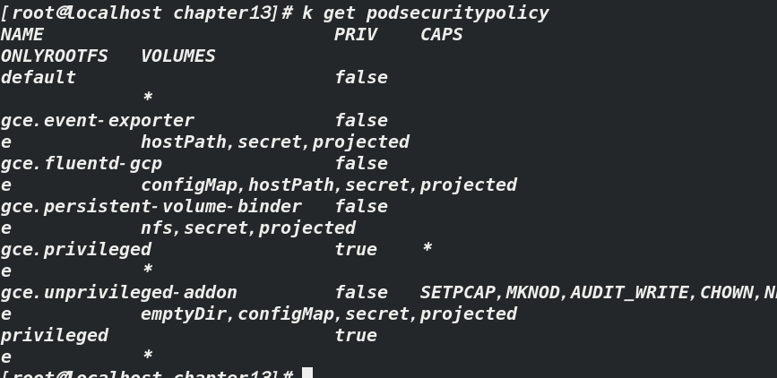
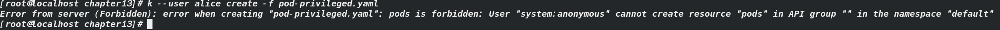

# 对不同的用户和组分配不同的PodSecurityPolicy

`PodSecurityPolicy`是集群级别的资源，意味着他不能存储和应用在某一特定的命名空间上；

对不同的用户分配不同的`PodSecurityPolicy`是通过RBAC机制来实现的


k=kubetcl

首先，创建一个允许部署特权容器的PodSecurityPolicy

```
apiVersion: extensions/v1beta1
kind: PodSecurityPolicy
metadata:
  name: privileged   
spec:
  privileged: true   -----允许创建特权容器
  runAsUser:
    rule: RunAsAny
  fsGroup:
    rule: RunAsAny
  supplementalGroups:
    rule: RunAsAny
  seLinux:
    rule: RunAsAny
  volumes:
  - '*'
```

创建一个不允许部署特权容器的`PodSecurityPolicy`

```
apiVersion: extensions/v1beta1
kind: PodSecurityPolicy
metadata:
  name: default
spec:
  hostIPC: false
  hostPID: false
  hostNetwork: false
  hostPorts:
  - min: 10000
    max: 11000
  - min: 13000
    max: 14000
  privileged: false        ----不允许部署特权容器
  readOnlyRootFilesystem: true
  runAsUser:
    rule: RunAsAny
  fsGroup:
    rule: RunAsAny
  supplementalGroups:
    rule: RunAsAny
  seLinux:
    rule: RunAsAny
  volumes:
  - '*'
```

`kubectl create`之后，集群中有两个`PodSecurityPolicy`



即`default`与p`rivileged`，可以看到PRIV属性两个相反

部署pod时，如果任一策略允许使用pod中使用到的特性，API服务器就会接收这个pod

考虑如下：Alice和Bob，Alice只能部署非特权pod，Bob可以部署特权pod，可以通过让Alice只能使用default `podseclitypolicy`，而Bob可以使用以上两个`podseclitypolicy`来做到

## 使用RBAC将不同的podseclitypolicy分配给不同用户

创建两个clusterrole，分别允许使用其中一个策略

`k create clusterrole psp-default --verb=use --resource=podsecuritypolicies --resource-name=default`

`k create clusterrole psp-privileged --verb=use --resource=podsecuritypolicies --resource-name=privileged`

然后把这两个策略绑定到已认证的用户上，要将psp-default clusterrole绑定到所有已认证的用户上，否则没有用户可以创建pod，因为podseclitypolicy访问控制插件会因为没有找到任何策略而拒绝创建pod，所有已认证用户都属于system:authenticated，因此需要将clueterrole绑定到这个组

`k create clusterrolebinding psp-all-users --clusterrole=psp-default --group=system:authenticated`

然后将psp-privileged clusterrole绑定到bob用户，如果绑不上，先用后面的命令创建用户

`k create clusterrolebinding psp-bob --clusterrole=psp-privileged --user=bob`

## 为kubectl创建不同用户

`k config set-credentials alice --username=alice --password=password`

`k config set-credentials bob --username=bob --password=password`

创建一个特权模式的pod

```
apiVersion: v1
kind: Pod
metadata:
  name: pod-privileged
spec:
  containers:
  - name: main
    image: alpine
    command: ["/bin/sleep", "999999"]
    securityContext:
      privileged: true
```

`k --user alice create -f pod-privileged.yaml`

会发现这个会被forbidden

`k --user bob create -f pod-privileged.yaml`

这个可以正常创建特权pod

注：比较尴尬的是，我在最后用alice创建pod时，报的错是这样的



暂时没弄明白，如果有人知道，麻烦告知，虽然我最后没走通，但大致的步骤就是这样的


参考《kubernetes in action》


