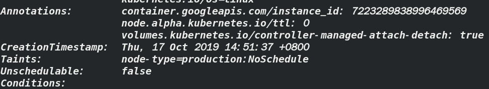
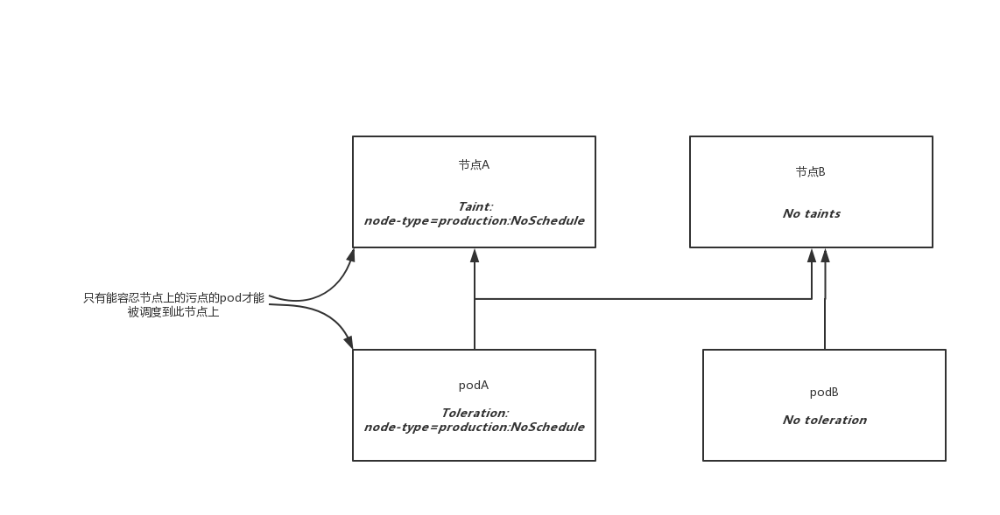
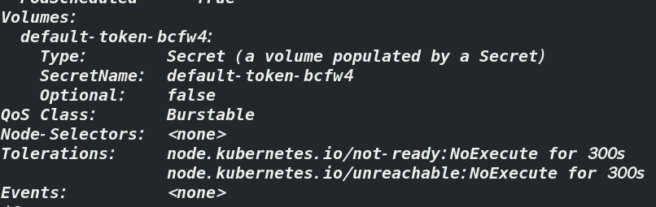
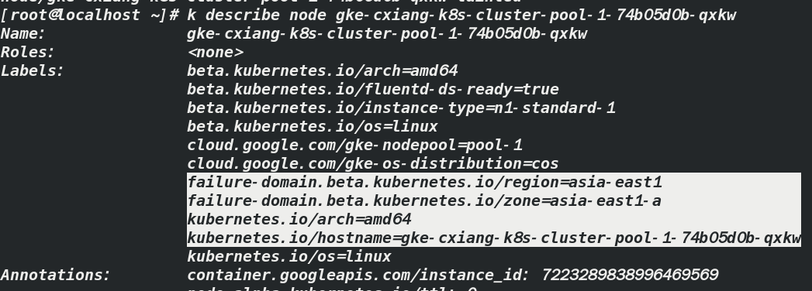
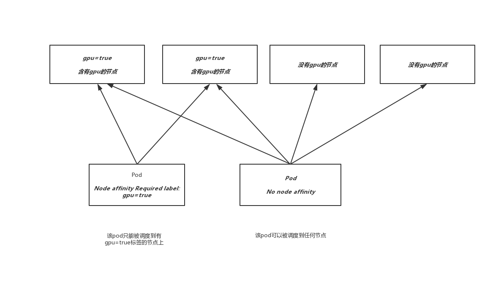
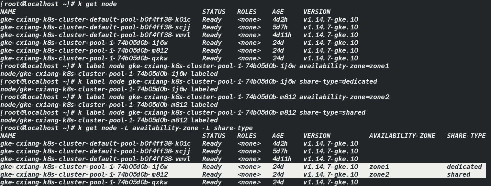

# kubernetes中的高级调度

我们在创建一个pod后会有调度器按照一定规则调度到某个节点上去，那么如果我不想让这个pod被调度到某一个节点上去该怎么办？或者我想让这个pod被调度到特定节点上去该如何？

## 1. 使用污点和容忍度阻止节点调度到特定节点

污点：是在不修改已有pod信息的前提下，通过在节点上添加污点信息，来拒绝pod在某些节点上的部署，可以暂时把它想象成一个标签，pod中如果没有这个对应的“标签”，就不能被调度到这个节点上

#### 显示节点的污点信息

通过`kubectl describe node node-name`显示节点信息



其中`Taints`即是污点信息，这是我刚才加的污点信息，普通的节点都是`<none>`

图中显示的是该节点包含一个污点，污点包含一个`key`，`value`和`effect`，表现为`<key>=<value>:<effect>`

图中显示信息为包含一个为`node-type`的`key`，一个`production`的`value`，一个值为`NoSchedule`的`effect`

> 有时也可以是这种形式`node-type: NoSchedule`，表示value为空

这个污点将阻止pod调度到这个节点上，除非有pod能容忍这个污点，如下图



#### 显示pod的污点容忍度

`k describe pod pod-name`



即途中的Tolerations属性，该pod包含两个污点容忍度

> 这两个容忍度表示该pod将容忍所在节点处于notReady和unreachable状态维持300秒，当kubernetes控制器监测到有节点处于notReady和unreachable状态时，将会等待300秒，如果状态持续的话，之后会把该pod调度到其他节点，即节点失效后pod重新调度最长等待时间

#### 污点的效果

每一个污点都可以关联一个效果，有以下三种

- NoSchedule：如果pod没有容忍这些污点，pod则不能被调度到包含这些污点的节点上
- PreferNoSchedule：尽量阻止pod被调度到这个节点上，但是如果没有其他节点可以调度，pod依然会被调度到这个节点上，他是NoSchedule的一个宽松版本
- NoExecute：前两个只在调度期间起作用，而NoExecute也会影响正在节点上运行着的pod，如果在一个节点上添加了NoExecute污点，那些在该节点上运行着的pod，如果没有容忍这个NoExecute污点，将会被从这个节点上剔除

### 1.1 在节点上添加自定义污点

假设你有一个kubernetes集群，上面同时有生产环境和测试环境，而测试环境的pod不能运行在生产环境的节点上，可以通过在生产环境的节点上添加污点来实现

通过以下命令来为节点添加污点

```
kubectl taint node gke-cxiang-k8s-cluster-pool-1-74b05d0b-qxkw node-type=production:NoSchedule
```

然后，你再部署一个常规的pod的多个副本，会发现没有一个pod被部署到你添加了污点的节点上

### 1.2 在pod上添加容忍度

刚才为生产环境添加了污点，防止测试环境的pod被调度上来，那我如何让生产环境的pod被调度到生产环境的节点上呢？

```
apiVersion: extensions/v1beta1
kind: Deployment
metadata:
  name: prod
spec:
  replicas: 5
  template:
    metadata:
      labels:
        app: prod
    spec:
      containers:
      - args:
        - sleep
        - "99999"
        image: busybox
        name: main
      tolerations:            ----此处的污点容忍度允许pod被调度到生产环境的节点上
      - key: node-type
        operator: Equal
        value: production
        effect: NoSchedule
```

参考上面的代码清单

## 2. 使用节点亲缘性将pod调度到特定节点

污点是用来让pod远离节点的，那么节点亲缘性(node affinity)是用来让pod亲近节点的,即这种机制允许你通知kubernetes将pod只调度到某个节点或节点子集上

早期版本中，初始的节点亲缘性就是nodeSelector子段，节点必须包含所有pod中对应字段中指定的标签，才能成为pod调度的目标节点

nodeSelector实现简单。但是不能满足所有要求，最终会被弃用

下面介绍节点亲缘性

#### 检查默认的节点标签

`kubectl describe node gke-cxiang-k8s-cluster-pool-1-74b05d0b-qxkw`



因为我使用的是`Google kubernetes engine`,所以我查看的节点中有图中所示的这些默认标签，但涉及节点亲缘性只有其中的三个，即

- failure-domain.beta.kubernetes.io/region=asia-east1：表示该节点所在的地理区域


- failure-domain.beta.kubernetes.io/zone=asia-east1-a：表示该节点所在的可用性区域(availability zone)


- kubernetes.io/hostname=gke-cxiang-k8s-cluster-pool-1-74b05d0b-qxkw：该节点的主机名

### 2.1 指定强制性节点亲缘性规则

以前的nodeSelector描述如下

```
apiVersion: v1
kind: Pod
metadata:
  name: kubia-gpu
spec:
  nodeSelector:      ----表示该pod只会被调度到包含了gpu=true的标签的节点中
    gpu: "true"
  containers:
  - image: luksa/kubia
    name: kubia
```

现在将节点选择器换成节点亲缘性

```
apiVersion: v1
kind: Pod
metadata:
  name: kubia-gpu
spec:
  affinity:
    nodeAffinity:
      requiredDuringSchedulingIgnoredDuringExecution:
        nodeSelectorTerms:
        - matchExpressions:
          - key: gpu
            operator: In
            values:
            - "true"
  containers:
  - image: luksa/kubia
    name: kubia
```

看起来比nodeSelector复杂多了对吧！别怕，知道了他们的意义会发现其实很简单

#### 节点亲缘性属性名的意义

- affinity：很简单，亲缘性喽
- nodeAffinity：加个node那就是特指节点亲缘性喽
- requiredDuringSchedulingIgnoredDuringExecution：这个比较长，分成两部分来看
  -  requiredDuringScheduling：表明了该字段下定义的规则，为了让pod能调度到该节点上，明确指出了该节点必须包含的标签，即pod只能调度到这种的节点上去，为了便于理解，先说一下另一种方式，即preferredDuringScheduling，即优先调用到这种的节点上去，后面会讨论到
  - IgnoredDuringExecution：表明了该字段下定义的规则，不会影响已经在节点上运行着的pod，目前的规则都是以IgnoredDuringExecution结尾的，因为当前的节点亲缘性规则智慧影响正在被调度的pod，最终，kubernetes也会支持RequiredDuringExecution，即去除节点上的某个标签，那些需要节点包含该标签的pod将会被剔除

#### 了解节点选择器的条件

随后的`nodeSelectorTerms`和`matchExpressions`表明了节点的标签必须满足哪一种表达式才能满足pod的调度条件，例子中的表达式表示节点必须包含一个gpu的标签，并且该标签的值必须为`true`,如下图




### 2.2 调度pod时优先考虑某些节点

节点亲缘性也可以在调度时指定优先级，即通过前面提到的`preferredDuringSchedulingIgnoredDuringExecution`来实现

至于为什么会有这样的要求，略

#### 给节点加上标签



如图，我给其中两个节点分别加了`availability-zone`和`share-type`标签

#### 指定优先级节点亲缘性规则

如下代码清单

```
apiVersion: extensions/v1beta1
kind: Deployment
metadata:
  name: pref
spec:
  replicas: 5
  template:
    metadata:
      labels:
        app: pref
    spec:
      affinity:
        nodeAffinity:
          preferredDuringSchedulingIgnoredDuringExecution:  ----指定优先级的，不是必需的
          - weight: 80             ----节点优先调度到包含availability-zone=zone1标签的节点上
            preference:
              matchExpressions:
              - key: availability-zone
                operator: In
                values:
                - zone1
          - weight: 20           ----同时优先调度到包含share-type=dedicated标签的节点上，但它的 
            preference:              优先级是上一个的1/4
              matchExpressions:
              - key: share-type
                operator: In
                values:
                - dedicated
      containers:
      - args:
        - sleep
        - "99999"
        image: busybox
        name: main
```

如果你真的创建了这些，然后又创建了好多个pod去验证是不是真的如上所说调度，最后发现并没有完全按照你设定的优先级调度，不要着急，因为kubernetes还使用了其他的优先级函数来决定pod被调度到那个节点，比如`Selector SpreadPriority`函数，这个函数确保属于同一个replicaSet或者service的pod，将分散部署在不同节点上，以避免单个节点失效导致整个服务宕机.......

### 2.3 使用pod亲缘性与非亲缘性对pod进行协同部署

假如，你有一个后端pod和一个前端pod，你希望能将他们部署在同一个节点上，可以降低延迟，提高性能，如何实现呢？

#### 2.3.1 使用pod间亲缘性将多个pod部署在同一节点中

首先部署后端

```
kubectl run backend -l app=backend --image busybox -- sleep 999999
```

`-l`即`--label`，必须要加

##### 在pod定义中指定亲缘性

前端代码清单如下

```
apiVersion: extensions/v1beta1
kind: Deployment
metadata:
  name: frontend
spec:
  replicas: 5
  template:
    metadata:
      labels:
        app: frontend
    spec:
      affinity:
        podAffinity:
          requiredDuringSchedulingIgnoredDuringExecution:
          - topologyKey: kubernetes.io/hostname
            labelSelector:
              matchLabels:
                app: backend
      containers:
      - name: main
        image: busybox
        args:
        - sleep
        - "99999"
```

代码清单显示了，该部署将创建包含强制性要求的pod，其中要求pod将被调度到和其他包含app=backend标签的pod所在的相同节点上(通过topologyKey字段指定，如果觉得不好记的话可以查一下topology这个单词，它是拓扑，拓扑学的意思，可以做一个联想记忆)


有趣的是，如果你删除了后端pod，调度器会再次将后端pod调度到之前的节点，即前端pod所在的节点，即便后端pod没有任何亲缘性规则，这种情况很合理，因为假设后端pod被误删除而被调度到其他节点，前端pod的亲缘性规则就被打破了


##### 在同一个可用性区域中协同部署pod

将`topologyKey`属性设置为`failure-domain.beta.kubernetes.io/zone`

##### 在同一个地域中协同部署

将`topologyKey`属性设置为`failure-domain.beta.kubernetes.io/region`


调度时，默认只匹配同一命名空间中的pod，要想匹配其他命名空间中的pod，可以在`labelSelector`

同一级添加`namespaces`字段


### 2.4 利用pod的非亲缘性分开调度pod

与上面的情况相反，有时我们希望两个pod远离彼此，这种特性叫做pod非亲缘性，那么如何实现呢？很简单

把上面的`podAffinity`换成`podAntiAffinity`即可，即

```
......
spec:
      affinity:
        podAntiAffinity:
          requiredDuringSchedulingIgnoredDuringExecution:
          - topologyKey: kubernetes.io/hostname
            labelSelector:
              matchLabels:
                app: frontend
......
```


